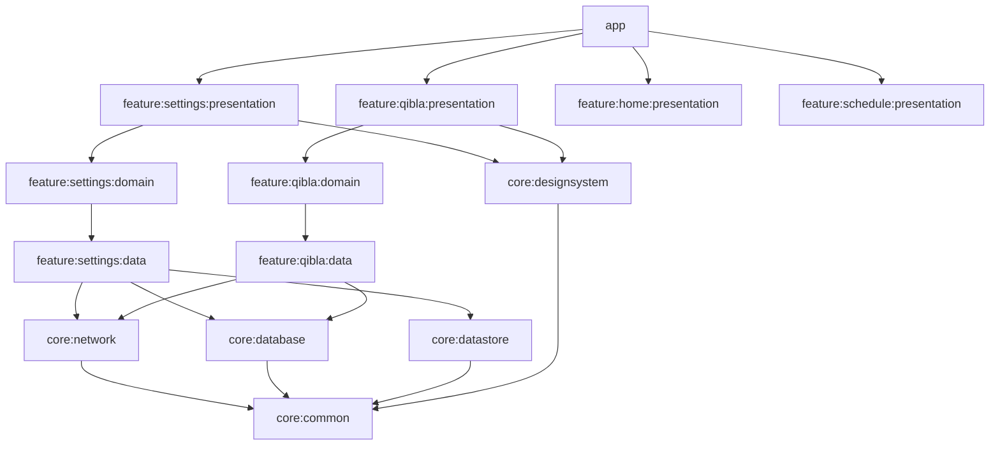

# Prayer Times Android Application - Technical Architecture Analysis
**Modern Android Native Implementation**

**Analysis Date:** February 18, 2026  
**Platform:** Android Native (Kotlin + Jetpack Compose)  
**Architecture:** Clean Architecture + Multi-Module  
**Analyst Role:** Senior Android Architecture & Engineering

---

## Executive Summary

This document provides a comprehensive technical analysis and Android-native implementation blueprint 
for the Prayer Times application, focusing on the Settings module and Qibla Direction feature. The 
analysis presents a production-ready architecture using modern Android development practices with 
Clean Architecture principles and multi-module design.

### Technology Stack
```
Language:           Kotlin 1.9+
UI Framework:       Jetpack Compose
Architecture:       Clean Architecture (Presentation → Domain → Data)
Module Structure:   Multi-module (Feature-based + Layer-based)
Dependency Injection: Koin
Networking:         Retrofit + Ktor Client (hybrid approach)
Database:           Room Database
Preferences:        DataStore<Preferences>
Async:              Kotlin Coroutines + Flow
Navigation:         Navigation Compose
Prayer Calculation: Adhan Library
Date/Time:          kotlinx-datetime
Image Loading:      Coil
Testing:            JUnit5 + Truth + Turbine
```

---

## Table of Contents

1. [Multi-Module Architecture](#1-multi-module-architecture)
2. [Clean Architecture Layers](#2-clean-architecture-layers)
3. [Settings Module Deep Dive](#3-settings-module-deep-dive)
4. [Qibla Direction Module](#4-qibla-direction-module)
5. [Data Layer Implementation](#5-data-layer-implementation)
6. [Domain Layer Implementation](#6-domain-layer-implementation)
7. [Presentation Layer Implementation](#7-presentation-layer-implementation)
8. [Dependency Injection Setup](#8-dependency-injection-setup)
9. [Navigation Architecture](#9-navigation-architecture)
10. [Testing Strategy](#10-testing-strategy)
11. [Gradle Configuration](#11-gradle-configuration)
12. [Production Deployment Checklist](#12-production-deployment-checklist)

---

## 1. Multi-Module Architecture

### 1.1 Module Structure Overview

```
PrayerTimesApp/
│
├── app/                                    # Application module
│   ├── src/main/
│   │   ├── kotlin/com/prayertimes/
│   │   │   ├── PrayerTimesApplication.kt
│   │   │   ├── MainActivity.kt
│   │   │   └── di/AppModule.kt
│   │   └── AndroidManifest.xml
│   └── build.gradle.kts
│
├── core/                                   # Core modules
│   ├── common/                             # Shared utilities
│   │   ├── src/main/kotlin/
│   │   │   ├── utils/
│   │   │   ├── extensions/
│   │   │   └── constants/
│   │   └── build.gradle.kts
│   │
│   ├── network/                            # Network layer
│   │   ├── src/main/kotlin/
│   │   │   ├── retrofit/
│   │   │   ├── ktor/
│   │   │   └── models/
│   │   └── build.gradle.kts
│   │
│   ├── database/                           # Database layer
│   │   ├── src/main/kotlin/
│   │   │   ├── room/
│   │   │   ├── dao/
│   │   │   └── entities/
│   │   └── build.gradle.kts
│   │
│   ├── datastore/                          # DataStore layer
│   │   ├── src/main/kotlin/
│   │   │   └── preferences/
│   │   └── build.gradle.kts
│   │
│   └── designsystem/                       # Design system (Compose components)
│       ├── src/main/kotlin/
│       │   ├── components/
│       │   ├── theme/
│       │   └── icons/
│       └── build.gradle.kts
│
├── feature/                                # Feature modules
│   ├── settings/
│   │   ├── data/                           # Settings data layer
│   │   │   ├── src/main/kotlin/
│   │   │   │   ├── repository/
│   │   │   │   ├── datasource/
│   │   │   │   └── mapper/
│   │   │   └── build.gradle.kts
│   │   │
│   │   ├── domain/                         # Settings domain layer
│   │   │   ├── src/main/kotlin/
│   │   │   │   ├── model/
│   │   │   │   ├── repository/
│   │   │   │   └── usecase/
│   │   │   └── build.gradle.kts
│   │   │
│   │   └── presentation/                   # Settings UI layer
│   │       ├── src/main/kotlin/
│   │       │   ├── screen/
│   │       │   ├── viewmodel/
│   │       │   └── component/
│   │       └── build.gradle.kts
│   │
│   ├── qibla/
│   │   ├── data/
│   │   ├── domain/
│   │   └── presentation/
│   │
│   ├── home/
│   │   ├── data/
│   │   ├── domain/
│   │   └── presentation/
│   │
│   └── schedule/
│       ├── data/
│       ├── domain/
│       └── presentation/
│
└── buildSrc/                               # Build configuration
    └── src/main/kotlin/
        ├── Dependencies.kt
        ├── Versions.kt
        └── Modules.kt
```

### 1.2 Module Dependency Graph



### 1.3 Module Responsibility Matrix

| Module | Responsibility | External Dependencies | Internal Dependencies |
|--------|---------------|----------------------|----------------------|
| **app** | Application entry, DI setup, MainActivity | Koin, Compose Navigation | All feature:*:presentation |
| **core:common** | Utilities, extensions, constants | kotlinx-datetime | None |
| **core:network** | Retrofit + Ktor setup, API interfaces | Retrofit, Ktor, OkHttp | core:common |
| **core:database** | Room setup, DAOs, entities | Room | core:common |
| **core:datastore** | DataStore setup, preferences | DataStore | core:common |
| **core:designsystem** | Compose components, theme | Compose, Coil | core:common |
| **feature:settings:domain** | Business logic, use cases | None (pure Kotlin) | None |
| **feature:settings:data** | Repository implementation | Retrofit, Room, DataStore | settings:domain, core:* |
| **feature:settings:presentation** | Composables, ViewModels | Compose, Koin | settings:domain, core:designsystem |

---

## 2. Clean Architecture Layers

### 2.1 Architecture Principles

```
┌─────────────────────────────────────────────────────────────┐
│                    PRESENTATION LAYER                        │
│  ┌──────────────┐  ┌──────────────┐  ┌──────────────┐      │
│  │  Composable  │  │  ViewModel   │  │     State    │      │
│  │   Screens    │←─│   + Flow     │←─│   Models     │      │
│  └──────────────┘  └──────────────┘  └──────────────┘      │
└────────────────────────┬────────────────────────────────────┘
                         │ Uses
                         ↓
┌─────────────────────────────────────────────────────────────┐
│                      DOMAIN LAYER                            │
│  ┌──────────────┐  ┌──────────────┐  ┌──────────────┐      │
│  │   Use Cases  │  │   Domain     │  │  Repository  │      │
│  │              │→ │   Models     │  │  Interfaces  │      │
│  └──────────────┘  └──────────────┘  └──────────────┘      │
└────────────────────────┬────────────────────────────────────┘
                         │ Implements
                         ↓
┌─────────────────────────────────────────────────────────────┐
│                       DATA LAYER                             │
│  ┌──────────────┐  ┌──────────────┐  ┌──────────────┐      │
│  │  Repository  │  │  Data Source │  │     DTO      │      │
│  │    Impl      │→ │  (Remote/    │  │   Entities   │      │
│  │              │  │   Local)     │  │              │      │
│  └──────────────┘  └──────────────┘  └──────────────┘      │
└─────────────────────────────────────────────────────────────┘
```

### 2.2 Dependency Rule

**Golden Rule:** Dependencies point INWARD only
- ✅ Presentation → Domain → Data
- ✅ Domain has NO dependencies on Android framework
- ✅ Data depends on Domain (for interfaces)
- ❌ Domain NEVER depends on Data or Presentation

### 2.3 Data Flow

```
User Interaction
      ↓
   Composable
      ↓
   ViewModel (emits Intent)
      ↓
   Use Case (business logic)
      ↓
   Repository Interface (domain)
      ↓
   Repository Impl (data)
      ↓
   Data Source (Remote/Local)
      ↓
   Flow<Result<DomainModel>>
      ↑
   ViewModel (collects)
      ↑
   Composable (observes State)
      ↑
   UI Updates
```

---

## 3. Settings Module Deep Dive

### 3.1 Domain Layer (`feature:settings:domain`)

#### **3.1.1 Domain Models**

```kotlin
// feature/settings/domain/src/main/kotlin/com/prayertimes/settings/domain/model/

//package com.prayertimes.settings.domain.model

/**
 * Pure domain model - no Android dependencies
 */
data class PrayerSettings(
    val location: LocationSettings,
    val calculationMethod: CalculationMethod,
    val juristicMethod: JuristicMethod,
    val notificationSettings: NotificationSettings,
    val languageSettings: LanguageSettings,
    val hijriAdjustment: HijriAdjustment
)

data class LocationSettings(
    val cityName: String,
    val country: String,
    val latitude: Double,
    val longitude: Double,
    val detectionMethod: LocationDetectionMethod,
    val timeZone: String
) {
    fun displayName(): String = "$cityName, $country"
    
    fun coordinates(): Coordinates = Coordinates(latitude, longitude)
}

enum class LocationDetectionMethod {
    AUTO_GPS,
    MANUAL_ENTRY,
    CITY_SEARCH
}

data class Coordinates(
    val latitude: Double,
    val longitude: Double
) {
    init {
        require(latitude in -90.0..90.0) { "Latitude must be between -90 and 90" }
        require(longitude in -180.0..180.0) { "Longitude must be between -180 and 180" }
    }
}

enum class CalculationMethod(
    val displayName: String,
    val region: String,
    val fajrAngle: Double,
    val ishaAngle: Double,
    val description: String
) {
    MUSLIM_WORLD_LEAGUE(
        displayName = "Muslim World League",
        region = "Global",
        fajrAngle = 18.0,
        ishaAngle = 17.0,
        description = "Standard method used by most Islamic countries"
    ),
    ISNA(
        displayName = "Islamic Society of North America",
        region = "North America",
        fajrAngle = 15.0,
        ishaAngle = 15.0,
        description = "Commonly used in North America"
    ),
    EGYPT(
        displayName = "Egyptian General Authority of Survey",
        region = "Egypt",
        fajrAngle = 19.5,
        ishaAngle = 17.5,
        description = "Used by Egyptian General Authority of Survey"
    ),
    MAKKAH(
        displayName = "Umm Al-Qura University, Makkah",
        region = "Saudi Arabia",
        fajrAngle = 18.5,
        ishaAngle = 90.0, // 90 minutes after Maghrib
        description = "Used in Saudi Arabia"
    ),
    KARACHI(
        displayName = "University of Islamic Sciences, Karachi",
        region = "South Asia",
        fajrAngle = 18.0,
        ishaAngle = 18.0,
        description = "Used in Pakistan, Bangladesh, India, Afghanistan"
    ),
    TEHRAN(
        displayName = "Institute of Geophysics, University of Tehran",
        region = "Iran",
        fajrAngle = 17.7,
        ishaAngle = 14.0,
        description = "Used in Iran and some Shia communities"
    ),
    JAFARI(
        displayName = "Shia Ithna-Ashari, Leva Institute, Qum",
        region = "Shia Communities",
        fajrAngle = 16.0,
        ishaAngle = 14.0,
        description = "Used by Shia communities"
    ),
    GULF(
        displayName = "Gulf Region",
        region = "Gulf Region",
        fajrAngle = 19.5,
        ishaAngle = 90.0,
        description = "Used in Gulf countries"
    ),
    KUWAIT(
        displayName = "Kuwait",
        region = "Kuwait",
        fajrAngle = 18.0,
        ishaAngle = 17.5,
        description = "Used in Kuwait"
    ),
    QATAR(
        displayName = "Qatar",
        region = "Qatar",
        fajrAngle = 18.0,
        ishaAngle = 90.0,
        description = "Modified for Qatar"
    ),
    SINGAPORE(
        displayName = "Singapore",
        region = "Singapore/Malaysia",
        fajrAngle = 20.0,
        ishaAngle = 18.0,
        description = "Used in Singapore and Malaysia"
    ),
    FRANCE(
        displayName = "Union Organization Islamic de France",
        region = "France",
        fajrAngle = 12.0,
        ishaAngle = 12.0,
        description = "Used in France"
    ),
    TURKEY(
        displayName = "Diyanet İşleri Başkanlığı",
        region = "Turkey",
        fajrAngle = 18.0,
        ishaAngle = 17.0,
        description = "Turkish Directorate of Religious Affairs"
    ),
    RUSSIA(
        displayName = "Spiritual Administration of Muslims of Russia",
        region = "Russia",
        fajrAngle = 16.0,
        ishaAngle = 15.0,
        description = "Used in Russia"
    );
    
    companion object {
        fun getPopularMethods(): List<CalculationMethod> = listOf(
            MUSLIM_WORLD_LEAGUE, ISNA, EGYPT, MAKKAH, KARACHI
        )
    }
}

enum class JuristicMethod(
    val displayName: String,
    val shadowRatio: ShadowRatio,
    val schools: List<String>,
    val description: String
) {
    STANDARD(
        displayName = "Standard (Shafi, Maliki, Hanbali)",
        shadowRatio = ShadowRatio.SINGLE,
        schools = listOf("Shafi", "Maliki", "Hanbali", "Jafari"),
        description = "Shadow length = Object length + Shadow at noon"
    ),
    HANAFI(
        displayName = "Hanafi",
        shadowRatio = ShadowRatio.DOUBLE,
        schools = listOf("Hanafi"),
        description = "Shadow length = 2 × Object length + Shadow at noon"
    );
    
    enum class ShadowRatio(val multiplier: Double) {
        SINGLE(1.0),
        DOUBLE(2.0)
    }
}

data class NotificationSettings(
    val masterEnabled: Boolean,
    val prayerNotifications: List<PrayerNotification>,
    val soundSettings: SoundSettings,
    val advancedSettings: AdvancedNotificationSettings
)

data class PrayerNotification(
    val prayerType: PrayerType,
    val enabled: Boolean,
    val minutesBefore: Int, // 0, 5, 10, 15, 30, 60
    val soundEnabled: Boolean,
    val vibrationEnabled: Boolean
)

enum class PrayerType {
    FAJR, DHUHR, ASR, MAGHRIB, ISHA
}

data class SoundSettings(
    val selectedSound: NotificationSound
)

enum class NotificationSound(
    val displayName: String,
    val fileName: String,
    val duration: String
) {
    ADHAN("Adhan (Call to Prayer)", "adhan.mp3", "2:30"),
    TAKBIR("Takbir", "takbir.mp3", "0:15"),
    BELL("Simple Bell", "bell.mp3", "0:05"),
    CHIME("Chime", "chime.mp3", "0:08"),
    SILENT("Silent", "", "—")
}

data class AdvancedNotificationSettings(
    val persistentNotification: Boolean,
    val dndOverride: Boolean,
    val showOnLockScreen: Boolean
)

data class LanguageSettings(
    val selectedLanguage: Language
)

enum class Language(
    val code: String,
    val displayName: String,
    val nativeName: String,
    val flag: String,
    val isRtl: Boolean
) {
    ENGLISH("en", "English", "English", "🇬🇧", false),
    ARABIC("ar", "Arabic", "العربية", "🇸🇦", true),
    TURKISH("tr", "Turkish", "Türkçe", "🇹🇷", false),
    URDU("ur", "Urdu", "اردو", "🇵🇰", true),
    INDONESIAN("id", "Indonesian", "Bahasa Indonesia", "🇮🇩", false),
    BENGALI("bn", "Bengali", "বাংলা", "🇧🇩", false),
    MALAY("ms", "Malay", "Bahasa Melayu", "🇲🇾", false),
    FRENCH("fr", "French", "Français", "🇫🇷", false),
    GERMAN("de", "German", "Deutsch", "🇩🇪", false),
    SPANISH("es", "Spanish", "Español", "🇪🇸", false),
    RUSSIAN("ru", "Russian", "Русский", "🇷🇺", false),
    PERSIAN("fa", "Persian", "فارسی", "🇮🇷", true),
    CHINESE("zh", "Chinese", "中文", "🇨🇳", false),
    HINDI("hi", "Hindi", "हिन्दी", "🇮🇳", false),
    PORTUGUESE("pt", "Portuguese", "Português", "🇵🇹", false),
    DUTCH("nl", "Dutch", "Nederlands", "🇳🇱", false),
    ITALIAN("it", "Italian", "Italiano", "🇮🇹", false),
    POLISH("pl", "Polish", "Polski", "🇵🇱", false),
    SWEDISH("sv", "Swedish", "Svenska", "🇸🇪", false),
    JAPANESE("ja", "Japanese", "日本語", "🇯🇵", false);
    
    companion object {
        fun getPopularLanguages(): List<Language> = listOf(
            ENGLISH, ARABIC, TURKISH, URDU, INDONESIAN, BENGALI
        )
    }
}

data class HijriAdjustment(
    val days: Int // -2 to +2
) {
    init {
        require(days in -2..2) { "Hijri adjustment must be between -2 and +2 days" }
    }
    
    fun displayText(): String = when {
        days == 0 -> "No adjustment"
        days > 0 -> "+$days day${if (days > 1) "s" else ""}"
        else -> "$days day${if (days < -1) "s" else ""}"
    }
}

// Result wrapper for error handling
sealed class SettingsResult<out T> {
    data class Success<T>(val data: T) : SettingsResult<T>()
    data class Error(val exception: SettingsException) : SettingsResult<Nothing>()
    object Loading : SettingsResult<Nothing>()
}

sealed class SettingsException(message: String) : Exception(message) {
    object NetworkException : SettingsException("Network error occurred")
    object DatabaseException : SettingsException("Database error occurred")
    data class ValidationException(val field: String, val reason: String) : 
        SettingsException("Invalid $field: $reason")
    data class UnknownException(val throwable: Throwable) : 
        SettingsException(throwable.message ?: "Unknown error")
}
```

#### **3.1.2 Repository Interface**

```kotlin
// feature/settings/domain/src/main/kotlin/com/prayertimes/settings/domain/repository/

//package com.prayertimes.settings.domain.repository

//import com.prayertimes.settings.domain.model.*
//import kotlinx.coroutines.flow.Flow

/**
 * Repository interface defined in domain layer
 * Implementation will be in data layer
 */
interface SettingsRepository {
    
    /**
     * Observe all settings changes
     */
    fun observeSettings(): Flow<SettingsResult<PrayerSettings>>
    
    /**
     * Get current settings (one-shot)
     */
    suspend fun getSettings(): SettingsResult<PrayerSettings>
    
    /**
     * Update location settings
     */
    suspend fun updateLocation(location: LocationSettings): SettingsResult<Unit>
    
    /**
     * Update calculation method
     */
    suspend fun updateCalculationMethod(method: CalculationMethod): SettingsResult<Unit>
    
    /**
     * Update juristic method
     */
    suspend fun updateJuristicMethod(method: JuristicMethod): SettingsResult<Unit>
    
    /**
     * Update notification settings
     */
    suspend fun updateNotificationSettings(settings: NotificationSettings): SettingsResult<Unit>
    
    /**
     * Update language
     */
    suspend fun updateLanguage(language: Language): SettingsResult<Unit>
    
    /**
     * Update Hijri adjustment
     */
    suspend fun updateHijriAdjustment(adjustment: HijriAdjustment): SettingsResult<Unit>
    
    /**
     * Search cities by query
     */
    suspend fun searchCities(query: String): SettingsResult<List<LocationSettings>>
    
    /**
     * Get popular cities
     */
    suspend fun getPopularCities(): SettingsResult<List<LocationSettings>>
    
    /**
     * Get recent locations
     */
    suspend fun getRecentLocations(): SettingsResult<List<LocationSettings>>
    
    /**
     * Get current GPS location
     */
    suspend fun getCurrentGpsLocation(): SettingsResult<LocationSettings>
}
```

#### **3.1.3 Use Cases**

```kotlin
// feature/settings/domain/src/main/kotlin/com/prayertimes/settings/domain/usecase/

//package com.prayertimes.settings.domain.usecase

//import com.prayertimes.settings.domain.model.*
//import com.prayertimes.settings.domain.repository.SettingsRepository
//import kotlinx.coroutines.flow.Flow

/**
 * Base use case interface
 */
interface UseCase<in Params, out Result> {
    suspend operator fun invoke(params: Params): Result
}

interface FlowUseCase<in Params, out Result> {
    operator fun invoke(params: Params): Flow<Result>
}

// ============================================================================
// LOCATION USE CASES
// ============================================================================

/**
 * Get current location settings
 */
class GetLocationSettingsUseCase(
    private val repository: SettingsRepository
) : UseCase<Unit, SettingsResult<LocationSettings>> {
    
    override suspend fun invoke(params: Unit): SettingsResult<LocationSettings> {
        return when (val result = repository.getSettings()) {
            is SettingsResult.Success -> SettingsResult.Success(result.data.location)
            is SettingsResult.Error -> SettingsResult.Error(result.exception)
            SettingsResult.Loading -> SettingsResult.Loading
        }
    }
}

/**
 * Update location using GPS
 */
class UpdateLocationFromGpsUseCase(
    private val repository: SettingsRepository
) : UseCase<Unit, SettingsResult<LocationSettings>> {
    
    override suspend fun invoke(params: Unit): SettingsResult<LocationSettings> {
        return when (val result = repository.getCurrentGpsLocation()) {
            is SettingsResult.Success -> {
                repository.updateLocation(result.data)
                SettingsResult.Success(result.data)
            }
            is SettingsResult.Error -> SettingsResult.Error(result.exception)
            SettingsResult.Loading -> SettingsResult.Loading
        }
    }
}

/**
 * Update location manually
 */
data class UpdateLocationManuallyParams(
    val cityName: String,
    val country: String,
    val latitude: Double,
    val longitude: Double
)

class UpdateLocationManuallyUseCase(
    private val repository: SettingsRepository
) : UseCase<UpdateLocationManuallyParams, SettingsResult<Unit>> {
    
    override suspend fun invoke(params: UpdateLocationManuallyParams): SettingsResult<Unit> {
        // Validate coordinates
        return try {
            val location = LocationSettings(
                cityName = params.cityName,
                country = params.country,
                latitude = params.latitude,
                longitude = params.longitude,
                detectionMethod = LocationDetectionMethod.MANUAL_ENTRY,
                timeZone = "UTC" // Should be calculated from coordinates
            )
            repository.updateLocation(location)
        } catch (e: IllegalArgumentException) {
            SettingsResult.Error(
                SettingsException.ValidationException("coordinates", e.message ?: "Invalid coordinates")
            )
        }
    }
}

/**
 * Search cities
 */
data class SearchCitiesParams(val query: String)

class SearchCitiesUseCase(
    private val repository: SettingsRepository
) : UseCase<SearchCitiesParams, SettingsResult<List<LocationSettings>>> {
    
    override suspend fun invoke(params: SearchCitiesParams): SettingsResult<List<LocationSettings>> {
        if (params.query.length < 2) {
            return SettingsResult.Success(emptyList())
        }
        return repository.searchCities(params.query)
    }
}

// ============================================================================
// CALCULATION METHOD USE CASES
// ============================================================================

/**
 * Get all calculation methods
 */
class GetCalculationMethodsUseCase : UseCase<Unit, SettingsResult<List<CalculationMethod>>> {
    
    override suspend fun invoke(params: Unit): SettingsResult<List<CalculationMethod>> {
        return SettingsResult.Success(CalculationMethod.values().toList())
    }
}

/**
 * Get popular calculation methods
 */
class GetPopularCalculationMethodsUseCase : UseCase<Unit, SettingsResult<List<CalculationMethod>>> {
    
    override suspend fun invoke(params: Unit): SettingsResult<List<CalculationMethod>> {
        return SettingsResult.Success(CalculationMethod.getPopularMethods())
    }
}

/**
 * Update calculation method
 */
data class UpdateCalculationMethodParams(val method: CalculationMethod)

class UpdateCalculationMethodUseCase(
    private val repository: SettingsRepository
) : UseCase<UpdateCalculationMethodParams, SettingsResult<Unit>> {
    
    override suspend fun invoke(params: UpdateCalculationMethodParams): SettingsResult<Unit> {
        return repository.updateCalculationMethod(params.method)
    }
}

// ============================================================================
// JURISTIC METHOD USE CASES
// ============================================================================

/**
 * Get all juristic methods
 */
class GetJuristicMethodsUseCase : UseCase<Unit, SettingsResult<List<JuristicMethod>>> {
    
    override suspend fun invoke(params: Unit): SettingsResult<List<JuristicMethod>> {
        return SettingsResult.Success(JuristicMethod.values().toList())
    }
}

/**
 * Update juristic method
 */
data class UpdateJuristicMethodParams(val method: JuristicMethod)

class UpdateJuristicMethodUseCase(
    private val repository: SettingsRepository
) : UseCase<UpdateJuristicMethodParams, SettingsResult<Unit>> {
    
    override suspend fun invoke(params: UpdateJuristicMethodParams): SettingsResult<Unit> {
        return repository.updateJuristicMethod(params.method)
    }
}

// ============================================================================
// NOTIFICATION USE CASES
// ============================================================================

/**
 * Toggle master notification switch
 */
data class ToggleMasterNotificationParams(val enabled: Boolean)

class ToggleMasterNotificationUseCase(
    private val repository: SettingsRepository
) : UseCase<ToggleMasterNotificationParams, SettingsResult<Unit>> {
    
    override suspend fun invoke(params: ToggleMasterNotificationParams): SettingsResult<Unit> {
        return when (val result = repository.getSettings()) {
            is SettingsResult.Success -> {
                val updatedNotifications = result.data.notificationSettings.copy(
                    masterEnabled = params.enabled,
                    prayerNotifications = result.data.notificationSettings.prayerNotifications.map {
                        it.copy(enabled = params.enabled)
                    }
                )
                repository.updateNotificationSettings(updatedNotifications)
            }
            is SettingsResult.Error -> SettingsResult.Error(result.exception)
            SettingsResult.Loading -> SettingsResult.Loading
        }
    }
}

/**
 * Update individual prayer notification
 */
data class UpdatePrayerNotificationParams(
    val prayerType: PrayerType,
    val enabled: Boolean? = null,
    val minutesBefore: Int? = null,
    val soundEnabled: Boolean? = null,
    val vibrationEnabled: Boolean? = null
)

class UpdatePrayerNotificationUseCase(
    private val repository: SettingsRepository
) : UseCase<UpdatePrayerNotificationParams, SettingsResult<Unit>> {
    
    override suspend fun invoke(params: UpdatePrayerNotificationParams): SettingsResult<Unit> {
        return when (val result = repository.getSettings()) {
            is SettingsResult.Success -> {
                val updatedPrayerNotifications = result.data.notificationSettings.prayerNotifications.map { notification ->
                    if (notification.prayerType == params.prayerType) {
                        notification.copy(
                            enabled = params.enabled ?: notification.enabled,
                            minutesBefore = params.minutesBefore ?: notification.minutesBefore,
                            soundEnabled = params.soundEnabled ?: notification.soundEnabled,
                            vibrationEnabled = params.vibrationEnabled ?: notification.vibrationEnabled
                        )
                    } else {
                        notification
                    }
                }
                
                val updatedNotificationSettings = result.data.notificationSettings.copy(
                    prayerNotifications = updatedPrayerNotifications
                )
                
                repository.updateNotificationSettings(updatedNotificationSettings)
            }
            is SettingsResult.Error -> SettingsResult.Error(result.exception)
            SettingsResult.Loading -> SettingsResult.Loading
        }
    }
}

/**
 * Update notification sound
 */
data class UpdateNotificationSoundParams(val sound: NotificationSound)

class UpdateNotificationSoundUseCase(
    private val repository: SettingsRepository
) : UseCase<UpdateNotificationSoundParams, SettingsResult<Unit>> {
    
    override suspend fun invoke(params: UpdateNotificationSoundParams): SettingsResult<Unit> {
        return when (val result = repository.getSettings()) {
            is SettingsResult.Success -> {
                val updatedSoundSettings = SoundSettings(selectedSound = params.sound)
                val updatedNotificationSettings = result.data.notificationSettings.copy(
                    soundSettings = updatedSoundSettings
                )
                repository.updateNotificationSettings(updatedNotificationSettings)
            }
            is SettingsResult.Error -> SettingsResult.Error(result.exception)
            SettingsResult.Loading -> SettingsResult.Loading
        }
    }
}

// ============================================================================
// LANGUAGE USE CASES
// ============================================================================

/**
 * Get all languages
 */
class GetAllLanguagesUseCase : UseCase<Unit, SettingsResult<List<Language>>> {
    
    override suspend fun invoke(params: Unit): SettingsResult<List<Language>> {
        return SettingsResult.Success(Language.values().toList())
    }
}

/**
 * Update language
 */
data class UpdateLanguageParams(val language: Language)

class UpdateLanguageUseCase(
    private val repository: SettingsRepository
) : UseCase<UpdateLanguageParams, SettingsResult<Unit>> {
    
    override suspend fun invoke(params: UpdateLanguageParams): SettingsResult<Unit> {
        return repository.updateLanguage(params.language)
    }
}

// ============================================================================
// HIJRI ADJUSTMENT USE CASES
// ============================================================================

/**
 * Update Hijri adjustment
 */
data class UpdateHijriAdjustmentParams(val days: Int)

class UpdateHijriAdjustmentUseCase(
    private val repository: SettingsRepository
) : UseCase<UpdateHijriAdjustmentParams, SettingsResult<Unit>> {
    
    override suspend fun invoke(params: UpdateHijriAdjustmentParams): SettingsResult<Unit> {
        return try {
            val adjustment = HijriAdjustment(days = params.days)
            repository.updateHijriAdjustment(adjustment)
        } catch (e: IllegalArgumentException) {
            SettingsResult.Error(
                SettingsException.ValidationException("hijri_adjustment", e.message ?: "Invalid adjustment")
            )
        }
    }
}

// ============================================================================
// OBSERVE SETTINGS USE CASE
// ============================================================================

/**
 * Observe settings changes
 */
class ObserveSettingsUseCase(
    private val repository: SettingsRepository
) : FlowUseCase<Unit, SettingsResult<PrayerSettings>> {
    
    override fun invoke(params: Unit): Flow<SettingsResult<PrayerSettings>> {
        return repository.observeSettings()
    }
}
```

---

### 3.2 Data Layer (`feature:settings:data`)

#### **3.2.1 Data Models (DTOs & Entities)**

```kotlin
// feature/settings/data/src/main/kotlin/com/prayertimes/settings/data/local/entity/

////package com.prayertimes.settings.data.local.entity

//import androidx.room.Entity
//import androidx.room.PrimaryKey

@Entity(tableName = "locations")
data class LocationEntity(
    @PrimaryKey(autoGenerate = true)
    val id: Long = 0,
    val cityName: String,
    val country: String,
    val latitude: Double,
    val longitude: Double,
    val timeZone: String,
    val lastUsedTimestamp: Long = System.currentTimeMillis()
)

@Entity(tableName = "recent_searches")
data class RecentSearchEntity(
    @PrimaryKey(autoGenerate = true)
    val id: Long = 0,
    val searchQuery: String,
    val timestamp: Long = System.currentTimeMillis()
)
```

```kotlin
// feature/settings/data/src/main/kotlin/com/prayertimes/settings/data/local/preferences/

//package com.prayertimes.settings.data.local.preferences

//import androidx.datastore.preferences.core.*

/**
 * DataStore preference keys
 */
object SettingsPreferenceKeys {
    // Location
    val LOCATION_CITY = stringPreferencesKey("location_city")
    val LOCATION_COUNTRY = stringPreferencesKey("location_country")
    val LOCATION_LATITUDE = doublePreferencesKey("location_latitude")
    val LOCATION_LONGITUDE = doublePreferencesKey("location_longitude")
    val LOCATION_TIMEZONE = stringPreferencesKey("location_timezone")
    val LOCATION_DETECTION_METHOD = stringPreferencesKey("location_detection_method")
    
    // Calculation Method
    val CALCULATION_METHOD = stringPreferencesKey("calculation_method")
    
    // Juristic Method
    val JURISTIC_METHOD = stringPreferencesKey("juristic_method")
    
    // Notifications
    val NOTIFICATIONS_MASTER_ENABLED = booleanPreferencesKey("notifications_master_enabled")
    val NOTIFICATION_SOUND = stringPreferencesKey("notification_sound")
    
    // Individual prayer notifications (stored as JSON string for simplicity)
    val PRAYER_NOTIFICATIONS_JSON = stringPreferencesKey("prayer_notifications_json")
    
    // Advanced notification settings
    val NOTIFICATION_PERSISTENT = booleanPreferencesKey("notification_persistent")
    val NOTIFICATION_DND_OVERRIDE = booleanPreferencesKey("notification_dnd_override")
    val NOTIFICATION_LOCK_SCREEN = booleanPreferencesKey("notification_lock_screen")
    
    // Language
    val LANGUAGE_CODE = stringPreferencesKey("language_code")
    
    // Hijri Adjustment
    val HIJRI_ADJUSTMENT_DAYS = intPreferencesKey("hijri_adjustment_days")
}
```

#### **3.2.2 Data Sources**

```kotlin
// feature/settings/data/src/main/kotlin/com/prayertimes/settings/data/local/datasource/

//package com.prayertimes.settings.data.local.datasource

//import androidx.datastore.core.DataStore
//import androidx.datastore.preferences.core.Preferences
//import androidx.datastore.preferences.core.edit
//import com.prayertimes.settings.data.local.preferences.SettingsPreferenceKeys
//import kotlinx.coroutines.flow.Flow
//import kotlinx.coroutines.flow.map
//import kotlinx.serialization.encodeToString
//import kotlinx.serialization.json.Json

interface SettingsLocalDataSource {
    fun observePreferences(): Flow<Preferences>
    suspend fun saveLocationSettings(
        city: String,
        country: String,
        latitude: Double,
        longitude: Double,
        timeZone: String,
        detectionMethod: String
    )
    suspend fun saveCalculationMethod(method: String)
    suspend fun saveJuristicMethod(method: String)
    suspend fun saveNotificationMasterEnabled(enabled: Boolean)
    suspend fun saveNotificationSound(sound: String)
    suspend fun savePrayerNotificationsJson(json: String)
    suspend fun saveLanguage(languageCode: String)
    suspend fun saveHijriAdjustment(days: Int)
}

class SettingsLocalDataSourceImpl(
    private val dataStore: DataStore<Preferences>
) : SettingsLocalDataSource {
    
    override fun observePreferences(): Flow<Preferences> {
        return dataStore.data
    }
    
    override suspend fun saveLocationSettings(
        city: String,
        country: String,
        latitude: Double,
        longitude: Double,
        timeZone: String,
        detectionMethod: String
    ) {
        dataStore.edit { preferences ->
            preferences[SettingsPreferenceKeys.LOCATION_CITY] = city
            preferences[SettingsPreferenceKeys.LOCATION_COUNTRY] = country
            preferences[SettingsPreferenceKeys.LOCATION_LATITUDE] = latitude
            preferences[SettingsPreferenceKeys.LOCATION_LONGITUDE] = longitude
            preferences[SettingsPreferenceKeys.LOCATION_TIMEZONE] = timeZone
            preferences[SettingsPreferenceKeys.LOCATION_DETECTION_METHOD] = detectionMethod
        }
    }
    
    override suspend fun saveCalculationMethod(method: String) {
        dataStore.edit { preferences ->
            preferences[SettingsPreferenceKeys.CALCULATION_METHOD] = method
        }
    }
    
    override suspend fun saveJuristicMethod(method: String) {
        dataStore.edit { preferences ->
            preferences[SettingsPreferenceKeys.JURISTIC_METHOD] = method
        }
    }
    
    override suspend fun saveNotificationMasterEnabled(enabled: Boolean) {
        dataStore.edit { preferences ->
            preferences[SettingsPreferenceKeys.NOTIFICATIONS_MASTER_ENABLED] = enabled
        }
    }
    
    override suspend fun saveNotificationSound(sound: String) {
        dataStore.edit { preferences ->
            preferences[SettingsPreferenceKeys.NOTIFICATION_SOUND] = sound
        }
    }
    
    override suspend fun savePrayerNotificationsJson(json: String) {
        dataStore.edit { preferences ->
            preferences[SettingsPreferenceKeys.PRAYER_NOTIFICATIONS_JSON] = json
        }
    }
    
    override suspend fun saveLanguage(languageCode: String) {
        dataStore.edit { preferences ->
            preferences[SettingsPreferenceKeys.LANGUAGE_CODE] = languageCode
        }
    }
    
    override suspend fun saveHijriAdjustment(days: Int) {
        dataStore.edit { preferences ->
            preferences[SettingsPreferenceKeys.HIJRI_ADJUSTMENT_DAYS] = days
        }
    }
}
```

```kotlin
// feature/settings/data/src/main/kotlin/com/prayertimes/settings/data/remote/datasource/

//package com.prayertimes.settings.data.remote.datasource

//import com.prayertimes.settings.data.remote.api.GeocodingApi
//import com.prayertimes.settings.data.remote.model.CityDto

interface SettingsRemoteDataSource {
    suspend fun searchCities(query: String): List<CityDto>
    suspend fun reverseGeocode(latitude: Double, longitude: Double): CityDto
}

class SettingsRemoteDataSourceImpl(
    private val geocodingApi: GeocodingApi
) : SettingsRemoteDataSource {
    
    override suspend fun searchCities(query: String): List<CityDto> {
        return geocodingApi.searchCities(query)
    }
    
    override suspend fun reverseGeocode(latitude: Double, longitude: Double): CityDto {
        return geocodingApi.reverseGeocode(latitude, longitude)
    }
}
```

#### **3.2.3 Repository Implementation**

```kotlin
// feature/settings/data/src/main/kotlin/com/prayertimes/settings/data/repository/

//package com.prayertimes.settings.data.repository

//import com.prayertimes.settings.data.local.datasource.SettingsLocalDataSource
//import com.prayertimes.settings.data.local.preferences.SettingsPreferenceKeys
//import com.prayertimes.settings.data.mapper.SettingsMapper
//import com.prayertimes.settings.data.remote.datasource.SettingsRemoteDataSource
//import com.prayertimes.settings.domain.model.*
//import com.prayertimes.settings.domain.repository.SettingsRepository
//import kotlinx.coroutines.flow.Flow
//import kotlinx.coroutines.flow.catch
//import kotlinx.coroutines.flow.map
//import kotlinx.serialization.encodeToString
//import kotlinx.serialization.json.Json

class SettingsRepositoryImpl(
    private val localDataSource: SettingsLocalDataSource,
    private val remoteDataSource: SettingsRemoteDataSource,
    private val gpsProvider: GpsLocationProvider,
    private val mapper: SettingsMapper
) : SettingsRepository {
    
    override fun observeSettings(): Flow<SettingsResult<PrayerSettings>> {
        return localDataSource.observePreferences()
            .map { preferences ->
                val settings = mapper.mapPreferencesToDomainModel(preferences)
                SettingsResult.Success(settings)
            }
            .catch { exception ->
                emit(SettingsResult.Error(
                    SettingsException.DatabaseException
                ))
            }
    }
    
    override suspend fun getSettings(): SettingsResult<PrayerSettings> {
        return try {
            // Get from DataStore
            var settings: PrayerSettings? = null
            localDataSource.observePreferences()
                .map { preferences -> mapper.mapPreferencesToDomainModel(preferences) }
                .collect { settings = it }
            
            settings?.let {
                SettingsResult.Success(it)
            } ?: SettingsResult.Error(SettingsException.DatabaseException)
        } catch (e: Exception) {
            SettingsResult.Error(SettingsException.UnknownException(e))
        }
    }
    
    override suspend fun updateLocation(location: LocationSettings): SettingsResult<Unit> {
        return try {
            localDataSource.saveLocationSettings(
                city = location.cityName,
                country = location.country,
                latitude = location.latitude,
                longitude = location.longitude,
                timeZone = location.timeZone,
                detectionMethod = location.detectionMethod.name
            )
            SettingsResult.Success(Unit)
        } catch (e: Exception) {
            SettingsResult.Error(SettingsException.DatabaseException)
        }
    }
    
    override suspend fun updateCalculationMethod(method: CalculationMethod): SettingsResult<Unit> {
        return try {
            localDataSource.saveCalculationMethod(method.name)
            SettingsResult.Success(Unit)
        } catch (e: Exception) {
            SettingsResult.Error(SettingsException.DatabaseException)
        }
    }
    
    override suspend fun updateJuristicMethod(method: JuristicMethod): SettingsResult<Unit> {
        return try {
            localDataSource.saveJuristicMethod(method.name)
            SettingsResult.Success(Unit)
        } catch (e: Exception) {
            SettingsResult.Error(SettingsException.DatabaseException)
        }
    }
    
    override suspend fun updateNotificationSettings(settings: NotificationSettings): SettingsResult<Unit> {
        return try {
            localDataSource.saveNotificationMasterEnabled(settings.masterEnabled)
            localDataSource.saveNotificationSound(settings.soundSettings.selectedSound.name)
            
            // Serialize prayer notifications to JSON
            val json = Json.encodeToString(settings.prayerNotifications)
            localDataSource.savePrayerNotificationsJson(json)
            
            SettingsResult.Success(Unit)
        } catch (e: Exception) {
            SettingsResult.Error(SettingsException.DatabaseException)
        }
    }
    
    override suspend fun updateLanguage(language: Language): SettingsResult<Unit> {
        return try {
            localDataSource.saveLanguage(language.code)
            SettingsResult.Success(Unit)
        } catch (e: Exception) {
            SettingsResult.Error(SettingsException.DatabaseException)
        }
    }
    
    override suspend fun updateHijriAdjustment(adjustment: HijriAdjustment): SettingsResult<Unit> {
        return try {
            localDataSource.saveHijriAdjustment(adjustment.days)
            SettingsResult.Success(Unit)
        } catch (e: Exception) {
            SettingsResult.Error(SettingsException.DatabaseException)
        }
    }
    
    override suspend fun searchCities(query: String): SettingsResult<List<LocationSettings>> {
        return try {
            val cities = remoteDataSource.searchCities(query)
            val locationSettings = cities.map { mapper.mapCityDtoToDomain(it) }
            SettingsResult.Success(locationSettings)
        } catch (e: Exception) {
            SettingsResult.Error(SettingsException.NetworkException)
        }
    }
    
    override suspend fun getPopularCities(): SettingsResult<List<LocationSettings>> {
        // Return hardcoded popular cities
        val popularCities = listOf(
            LocationSettings("Istanbul", "Turkey", 41.0082, 28.9784, LocationDetectionMethod.CITY_SEARCH, "Europe/Istanbul"),
            LocationSettings("Cairo", "Egypt", 30.0444, 31.2357, LocationDetectionMethod.CITY_SEARCH, "Africa/Cairo"),
            LocationSettings("Dubai", "UAE", 25.2048, 55.2708, LocationDetectionMethod.CITY_SEARCH, "Asia/Dubai"),
            LocationSettings("London", "United Kingdom", 51.5074, -0.1278, LocationDetectionMethod.CITY_SEARCH, "Europe/London"),
            LocationSettings("New York", "USA", 40.7128, -74.0060, LocationDetectionMethod.CITY_SEARCH, "America/New_York"),
            LocationSettings("Jakarta", "Indonesia", -6.2088, 106.8456, LocationDetectionMethod.CITY_SEARCH, "Asia/Jakarta"),
            LocationSettings("Kuala Lumpur", "Malaysia", 3.1390, 101.6869, LocationDetectionMethod.CITY_SEARCH, "Asia/Kuala_Lumpur"),
            LocationSettings("Riyadh", "Saudi Arabia", 24.7136, 46.6753, LocationDetectionMethod.CITY_SEARCH, "Asia/Riyadh")
        )
        return SettingsResult.Success(popularCities)
    }
    
    override suspend fun getRecentLocations(): SettingsResult<List<LocationSettings>> {
        // TODO: Implement from Room database
        return SettingsResult.Success(emptyList())
    }
    
    override suspend fun getCurrentGpsLocation(): SettingsResult<LocationSettings> {
        return try {
            val location = gpsProvider.getCurrentLocation()
            
            // Reverse geocode to get city name
            val cityDto = remoteDataSource.reverseGeocode(location.latitude, location.longitude)
            val locationSettings = mapper.mapCityDtoToDomain(cityDto).copy(
                detectionMethod = LocationDetectionMethod.AUTO_GPS
            )
            
            SettingsResult.Success(locationSettings)
        } catch (e: Exception) {
            SettingsResult.Error(SettingsException.NetworkException)
        }
    }
}

// GPS Provider interface
interface GpsLocationProvider {
    suspend fun getCurrentLocation(): Coordinates
}
```

#### **3.2.4 Mappers**

```kotlin
// feature/settings/data/src/main/kotlin/com/prayertimes/settings/data/mapper/

//package com.prayertimes.settings.data.mapper

//import androidx.datastore.preferences.core.Preferences
//import com.prayertimes.settings.data.local.preferences.SettingsPreferenceKeys
//import com.prayertimes.settings.data.remote.model.CityDto
//import com.prayertimes.settings.domain.model.*
//import kotlinx.serialization.decodeFromString
//import kotlinx.serialization.json.Json

class SettingsMapper {
    
    fun mapPreferencesToDomainModel(preferences: Preferences): PrayerSettings {
        return PrayerSettings(
            location = LocationSettings(
                cityName = preferences[SettingsPreferenceKeys.LOCATION_CITY] ?: "Istanbul",
                country = preferences[SettingsPreferenceKeys.LOCATION_COUNTRY] ?: "Turkey",
                latitude = preferences[SettingsPreferenceKeys.LOCATION_LATITUDE] ?: 41.0082,
                longitude = preferences[SettingsPreferenceKeys.LOCATION_LONGITUDE] ?: 28.9784,
                detectionMethod = LocationDetectionMethod.valueOf(
                    preferences[SettingsPreferenceKeys.LOCATION_DETECTION_METHOD] ?: "AUTO_GPS"
                ),
                timeZone = preferences[SettingsPreferenceKeys.LOCATION_TIMEZONE] ?: "Europe/Istanbul"
            ),
            calculationMethod = CalculationMethod.valueOf(
                preferences[SettingsPreferenceKeys.CALCULATION_METHOD] ?: "ISNA"
            ),
            juristicMethod = JuristicMethod.valueOf(
                preferences[SettingsPreferenceKeys.JURISTIC_METHOD] ?: "STANDARD"
            ),
            notificationSettings = NotificationSettings(
                masterEnabled = preferences[SettingsPreferenceKeys.NOTIFICATIONS_MASTER_ENABLED] ?: true,
                prayerNotifications = mapPrayerNotifications(
                    preferences[SettingsPreferenceKeys.PRAYER_NOTIFICATIONS_JSON]
                ),
                soundSettings = SoundSettings(
                    selectedSound = NotificationSound.valueOf(
                        preferences[SettingsPreferenceKeys.NOTIFICATION_SOUND] ?: "ADHAN"
                    )
                ),
                advancedSettings = AdvancedNotificationSettings(
                    persistentNotification = preferences[SettingsPreferenceKeys.NOTIFICATION_PERSISTENT] ?: true,
                    dndOverride = preferences[SettingsPreferenceKeys.NOTIFICATION_DND_OVERRIDE] ?: false,
                    showOnLockScreen = preferences[SettingsPreferenceKeys.NOTIFICATION_LOCK_SCREEN] ?: true
                )
            ),
            languageSettings = LanguageSettings(
                selectedLanguage = Language.values().find {
                    it.code == preferences[SettingsPreferenceKeys.LANGUAGE_CODE]
                } ?: Language.ENGLISH
            ),
            hijriAdjustment = HijriAdjustment(
                days = preferences[SettingsPreferenceKeys.HIJRI_ADJUSTMENT_DAYS] ?: 0
            )
        )
    }
    
    private fun mapPrayerNotifications(json: String?): List<PrayerNotification> {
        return if (json != null) {
            try {
                Json.decodeFromString(json)
            } catch (e: Exception) {
                getDefaultPrayerNotifications()
            }
        } else {
            getDefaultPrayerNotifications()
        }
    }
    
    private fun getDefaultPrayerNotifications(): List<PrayerNotification> {
        return PrayerType.values().map { prayerType ->
            PrayerNotification(
                prayerType = prayerType,
                enabled = true,
                minutesBefore = 10,
                soundEnabled = true,
                vibrationEnabled = true
            )
        }
    }
    
    fun mapCityDtoToDomain(dto: CityDto): LocationSettings {
        return LocationSettings(
            cityName = dto.name,
            country = dto.country,
            latitude = dto.latitude,
            longitude = dto.longitude,
            detectionMethod = LocationDetectionMethod.CITY_SEARCH,
            timeZone = dto.timezone ?: "UTC"
        )
    }
}
```

---

### 3.3 Presentation Layer (`feature:settings:presentation`)

#### **3.3.1 UI State Models**

```kotlin
// feature/settings/presentation/src/main/kotlin/com/prayertimes/settings/presentation/model/

//package com.prayertimes.settings.presentation.model

//import com.prayertimes.settings.domain.model.*

/**
 * UI State for Settings Screen
 */
data class SettingsUiState(
    val settings: PrayerSettings? = null,
    val isLoading: Boolean = false,
    val error: String? = null
)

/**
 * UI State for Location Settings Screen
 */
data class LocationSettingsUiState(
    val currentLocation: LocationSettings? = null,
    val searchQuery: String = "",
    val searchResults: List<LocationSettings> = emptyList(),
    val popularCities: List<LocationSettings> = emptyList(),
    val recentLocations: List<LocationSettings> = emptyList(),
    val isSearching: Boolean = false,
    val detectionMethod: LocationDetectionMethod = LocationDetectionMethod.AUTO_GPS,
    val showManualForm: Boolean = false,
    val manualInput: ManualLocationInput = ManualLocationInput(),
    val isLoadingGps: Boolean = false,
    val error: String? = null
)

data class ManualLocationInput(
    val cityName: String = "",
    val latitude: String = "",
    val longitude: String = "",
    val cityNameError: String? = null,
    val latitudeError: String? = null,
    val longitudeError: String? = null
)

/**
 * UI State for Calculation Method Screen
 */
data class CalculationMethodUiState(
    val currentMethod: CalculationMethod? = null,
    val popularMethods: List<CalculationMethod> = emptyList(),
    val otherMethods: List<CalculationMethod> = emptyList(),
    val isLoading: Boolean = false,
    val error: String? = null
)

/**
 * UI State for Juristic Method Screen
 */
data class JuristicMethodUiState(
    val currentMethod: JuristicMethod? = null,
    val allMethods: List<JuristicMethod> = emptyList(),
    val isLoading: Boolean = false,
    val error: String? = null
)

/**
 * UI State for Notification Settings Screen
 */
data class NotificationSettingsUiState(
    val masterEnabled: Boolean = true,
    val prayerNotifications: List<PrayerNotification> = emptyList(),
    val selectedSound: NotificationSound = NotificationSound.ADHAN,
    val advancedSettings: AdvancedNotificationSettings = AdvancedNotificationSettings(
        persistentNotification = true,
        dndOverride = false,
        showOnLockScreen = true
    ),
    val isLoading: Boolean = false,
    val error: String? = null
)

/**
 * UI State for Language Settings Screen
 */
data class LanguageSettingsUiState(
    val currentLanguage: Language = Language.ENGLISH,
    val popularLanguages: List<Language> = emptyList(),
    val allLanguages: List<Language> = emptyList(),
    val isLoading: Boolean = false,
    val error: String? = null
)

/**
 * UI State for Hijri Adjustment Screen
 */
data class HijriAdjustmentUiState(
    val currentAdjustment: Int = 0,
    val gregorianDate: String = "",
    val hijriDate: String = "",
    val isLoading: Boolean = false,
    val error: String? = null
)
```

#### **3.3.2 ViewModels**

```kotlin
// feature/settings/presentation/src/main/kotlin/com/prayertimes/settings/presentation/viewmodel/

//package com.prayertimes.settings.presentation.viewmodel

//import androidx.lifecycle.ViewModel
//import androidx.lifecycle.viewModelScope
//import com.prayertimes.settings.domain.model.SettingsResult
//import com.prayertimes.settings.domain.usecase.*
//import com.prayertimes.settings.presentation.model.SettingsUiState
//import kotlinx.coroutines.flow.*
//import kotlinx.coroutines.launch

class SettingsViewModel(
    private val observeSettingsUseCase: ObserveSettingsUseCase
) : ViewModel() {
    
    private val _uiState = MutableStateFlow(SettingsUiState())
    val uiState: StateFlow<SettingsUiState> = _uiState.asStateFlow()
    
    init {
        observeSettings()
    }
    
    private fun observeSettings() {
        observeSettingsUseCase(Unit)
            .onEach { result ->
                when (result) {
                    is SettingsResult.Success -> {
                        _uiState.update { it.copy(
                            settings = result.data,
                            isLoading = false,
                            error = null
                        )}
                    }
                    is SettingsResult.Error -> {
                        _uiState.update { it.copy(
                            isLoading = false,
                            error = result.exception.message
                        )}
                    }
                    SettingsResult.Loading -> {
                        _uiState.update { it.copy(isLoading = true) }
                    }
                }
            }
            .launchIn(viewModelScope)
    }
}
```

```kotlin
// LocationSettingsViewModel.kt

//package com.prayertimes.settings.presentation.viewmodel

//import androidx.lifecycle.ViewModel
//import androidx.lifecycle.viewModelScope
//import com.prayertimes.settings.domain.model.*
//import com.prayertimes.settings.domain.usecase.*
//import com.prayertimes.settings.presentation.model.LocationSettingsUiState
//import com.prayertimes.settings.presentation.model.ManualLocationInput
//import kotlinx.coroutines.Job
//import kotlinx.coroutines.delay
//import kotlinx.coroutines.flow.*
//import kotlinx.coroutines.launch

class LocationSettingsViewModel(
    private val getLocationSettingsUseCase: GetLocationSettingsUseCase,
    private val updateLocationFromGpsUseCase: UpdateLocationFromGpsUseCase,
    private val updateLocationManuallyUseCase: UpdateLocationManuallyUseCase,
    private val searchCitiesUseCase: SearchCitiesUseCase,
    private val getPopularCitiesUseCase: GetPopularCitiesUseCase,
    private val getRecentLocationsUseCase: GetRecentLocationsUseCase
) : ViewModel() {
    
    private val _uiState = MutableStateFlow(LocationSettingsUiState())
    val uiState: StateFlow<LocationSettingsUiState> = _uiState.asStateFlow()
    
    private var searchJob: Job? = null
    
    init {
        loadInitialData()
    }
    
    private fun loadInitialData() {
        viewModelScope.launch {
            // Load current location
            when (val result = getLocationSettingsUseCase(Unit)) {
                is SettingsResult.Success -> {
                    _uiState.update { it.copy(currentLocation = result.data) }
                }
                else -> {}
            }
            
            // Load popular cities
            when (val result = getPopularCitiesUseCase(Unit)) {
                is SettingsResult.Success -> {
                    _uiState.update { it.copy(popularCities = result.data) }
                }
                else -> {}
            }
            
            // Load recent locations
            when (val result = getRecentLocationsUseCase(Unit)) {
                is SettingsResult.Success -> {
                    _uiState.update { it.copy(recentLocations = result.data) }
                }
                else -> {}
            }
        }
    }
    
    fun onSearchQueryChange(query: String) {
        _uiState.update { it.copy(searchQuery = query) }
        
        // Debounced search
        searchJob?.cancel()
        searchJob = viewModelScope.launch {
            delay(300) // 300ms debounce
            if (query.length >= 2) {
                searchCities(query)
            } else {
                _uiState.update { it.copy(searchResults = emptyList()) }
            }
        }
    }
    
    private suspend fun searchCities(query: String) {
        _uiState.update { it.copy(isSearching = true) }
        
        when (val result = searchCitiesUseCase(SearchCitiesParams(query))) {
            is SettingsResult.Success -> {
                _uiState.update { it.copy(
                    searchResults = result.data,
                    isSearching = false
                )}
            }
            is SettingsResult.Error -> {
                _uiState.update { it.copy(
                    isSearching = false,
                    error = result.exception.message
                )}
            }
            else -> {}
        }
    }
    
    fun onDetectionMethodChange(method: LocationDetectionMethod) {
        _uiState.update { it.copy(
            detectionMethod = method,
            showManualForm = method == LocationDetectionMethod.MANUAL_ENTRY
        )}
    }
    
    fun onUseGpsLocation() {
        viewModelScope.launch {
            _uiState.update { it.copy(isLoadingGps = true) }
            
            when (val result = updateLocationFromGpsUseCase(Unit)) {
                is SettingsResult.Success -> {
                    _uiState.update { it.copy(
                        currentLocation = result.data,
                        isLoadingGps = false,
                        detectionMethod = LocationDetectionMethod.AUTO_GPS
                    )}
                }
                is SettingsResult.Error -> {
                    _uiState.update { it.copy(
                        isLoadingGps = false,
                        error = result.exception.message
                    )}
                }
                else -> {}
            }
        }
    }
    
    fun onManualInputChange(
        cityName: String? = null,
        latitude: String? = null,
        longitude: String? = null
    ) {
        _uiState.update {
            it.copy(manualInput = it.manualInput.copy(
                cityName = cityName ?: it.manualInput.cityName,
                latitude = latitude ?: it.manualInput.latitude,
                longitude = longitude ?: it.manualInput.longitude
            ))
        }
    }
    
    fun onSaveManualLocation() {
        val input = _uiState.value.manualInput
        
        // Validate input
        val errors = validateManualInput(input)
        if (errors.isNotEmpty()) {
            _uiState.update { it.copy(manualInput = input.copy(
                cityNameError = errors["cityName"],
                latitudeError = errors["latitude"],
                longitudeError = errors["longitude"]
            ))}
            return
        }
        
        viewModelScope.launch {
            val params = UpdateLocationManuallyParams(
                cityName = input.cityName,
                country = "", // Should be input by user or detected
                latitude = input.latitude.toDouble(),
                longitude = input.longitude.toDouble()
            )
            
            when (updateLocationManuallyUseCase(params)) {
                is SettingsResult.Success -> {
                    _uiState.update { it.copy(
                        showManualForm = false,
                        manualInput = ManualLocationInput()
                    )}
                }
                is SettingsResult.Error -> {
                    _uiState.update { it.copy(error = "Failed to save location") }
                }
                else -> {}
            }
        }
    }
    
    private fun validateManualInput(input: ManualLocationInput): Map<String, String> {
        val errors = mutableMapOf<String, String>()
        
        if (input.cityName.length < 2) {
            errors["cityName"] = "City name must be at least 2 characters"
        }
        
        val lat = input.latitude.toDoubleOrNull()
        if (lat == null || lat !in -90.0..90.0) {
            errors["latitude"] = "Latitude must be between -90 and 90"
        }
        
        val lng = input.longitude.toDoubleOrNull()
        if (lng == null || lng !in -180.0..180.0) {
            errors["longitude"] = "Longitude must be between -180 and 180"
        }
        
        return errors
    }
    
    fun onClearError() {
        _uiState.update { it.copy(error = null) }
    }
}
```

```kotlin
// CalculationMethodViewModel.kt

//package com.prayertimes.settings.presentation.viewmodel

//import androidx.lifecycle.ViewModel
//import androidx.lifecycle.viewModelScope
//import com.prayertimes.settings.domain.model.CalculationMethod
//import com.prayertimes.settings.domain.model.SettingsResult
//import com.prayertimes.settings.domain.usecase.*
//import com.prayertimes.settings.presentation.model.CalculationMethodUiState
//import kotlinx.coroutines.flow.*
//import kotlinx.coroutines.launch

class CalculationMethodViewModel(
    private val observeSettingsUseCase: ObserveSettingsUseCase,
    private val getPopularCalculationMethodsUseCase: GetPopularCalculationMethodsUseCase,
    private val updateCalculationMethodUseCase: UpdateCalculationMethodUseCase
) : ViewModel() {
    
    private val _uiState = MutableStateFlow(CalculationMethodUiState())
    val uiState: StateFlow<CalculationMethodUiState> = _uiState.asStateFlow()
    
    init {
        loadMethods()
        observeCurrentMethod()
    }
    
    private fun loadMethods() {
        viewModelScope.launch {
            when (val result = getPopularCalculationMethodsUseCase(Unit)) {
                is SettingsResult.Success -> {
                    val popular = result.data
                    val all = CalculationMethod.values().toList()
                    val other = all.filterNot { it in popular }
                    
                    _uiState.update { it.copy(
                        popularMethods = popular,
                        otherMethods = other
                    )}
                }
                else -> {}
            }
        }
    }
    
    private fun observeCurrentMethod() {
        observeSettingsUseCase(Unit)
            .onEach { result ->
                when (result) {
                    is SettingsResult.Success -> {
                        _uiState.update { it.copy(
                            currentMethod = result.data.calculationMethod,
                            isLoading = false
                        )}
                    }
                    is SettingsResult.Error -> {
                        _uiState.update { it.copy(
                            isLoading = false,
                            error = result.exception.message
                        )}
                    }
                    SettingsResult.Loading -> {
                        _uiState.update { it.copy(isLoading = true) }
                    }
                }
            }
            .launchIn(viewModelScope)
    }
    
    fun onSelectMethod(method: CalculationMethod) {
        viewModelScope.launch {
            when (updateCalculationMethodUseCase(UpdateCalculationMethodParams(method))) {
                is SettingsResult.Success -> {
                    // Method updated successfully
                    // UI will update automatically via observeSettings
                }
                is SettingsResult.Error -> {
                    _uiState.update { it.copy(error = "Failed to update method") }
                }
                else -> {}
            }
        }
    }
}
```

#### **3.3.3 Composable Screens**

```kotlin
// feature/settings/presentation/src/main/kotlin/com/prayertimes/settings/presentation/screen/

//package com.prayertimes.settings.presentation.screen

//import androidx.compose.foundation.layout.*
//import androidx.compose.foundation.lazy.LazyColumn
//import androidx.compose.foundation.lazy.items
//import androidx.compose.material3.*
//import androidx.compose.runtime.*
//import androidx.compose.ui.Modifier
//import androidx.compose.ui.unit.dp
//import com.prayertimes.core.designsystem.component.*
//import com.prayertimes.core.designsystem.theme.PrayerTimesTheme
//import com.prayertimes.settings.presentation.model.SettingsUiState
//import com.prayertimes.settings.presentation.viewmodel.SettingsViewModel
//import org.koin.androidx.compose.koinViewModel

@Composable
fun SettingsScreen(
    onNavigateToLocation: () -> Unit,
    onNavigateToCalculationMethod: () -> Unit,
    onNavigateToJuristicMethod: () -> Unit,
    onNavigateToNotifications: () -> Unit,
    onNavigateToLanguage: () -> Unit,
    onNavigateToHijriAdjustment: () -> Unit,
    viewModel: SettingsViewModel = koinViewModel()
) {
    val uiState by viewModel.uiState.collectAsState()
    
    SettingsScreenContent(
        uiState = uiState,
        onNavigateToLocation = onNavigateToLocation,
        onNavigateToCalculationMethod = onNavigateToCalculationMethod,
        onNavigateToJuristicMethod = onNavigateToJuristicMethod,
        onNavigateToNotifications = onNavigateToNotifications,
        onNavigateToLanguage = onNavigateToLanguage,
        onNavigateToHijriAdjustment = onNavigateToHijriAdjustment
    )
}

@OptIn(ExperimentalMaterial3Api::class)
@Composable
private fun SettingsScreenContent(
    uiState: SettingsUiState,
    onNavigateToLocation: () -> Unit,
    onNavigateToCalculationMethod: () -> Unit,
    onNavigateToJuristicMethod: () -> Unit,
    onNavigateToNotifications: () -> Unit,
    onNavigateToLanguage: () -> Unit,
    onNavigateToHijriAdjustment: () -> Unit
) {
    Scaffold(
        topBar = {
            PrayerTimesTopAppBar(
                title = "Prayer Settings",
                subtitle = "Customize your prayer experience"
            )
        }
    ) { paddingValues ->
        LazyColumn(
            modifier = Modifier
                .fillMaxSize()
                .padding(paddingValues)
                .padding(horizontal = 16.dp),
            verticalArrangement = Arrangement.spacedBy(24.dp),
            contentPadding = PaddingValues(vertical = 16.dp)
        ) {
            // Location & Calculation Section
            item {
                SettingsSectionHeader(
                    title = "Location & Calculation",
                    icon = { LocationIcon() }
                )
            }
            
            item {
                SettingsCard {
                    uiState.settings?.let { settings ->
                        SettingItem(
                            title = "Location",
                            subtitle = settings.location.displayName(),
                            badge = when (settings.location.detectionMethod) {
                                LocationDetectionMethod.AUTO_GPS -> "Auto"
                                LocationDetectionMethod.MANUAL_ENTRY -> "Manual"
                                LocationDetectionMethod.CITY_SEARCH -> null
                            },
                            onClick = onNavigateToLocation
                        )
                        
                        Divider()
                        
                        SettingItem(
                            title = "Calculation Method",
                            subtitle = settings.calculationMethod.displayName,
                            value = settings.calculationMethod.region,
                            onClick = onNavigateToCalculationMethod
                        )
                        
                        Divider()
                        
                        SettingItem(
                            title = "Juristic Method",
                            subtitle = settings.juristicMethod.displayName,
                            onClick = onNavigateToJuristicMethod
                        )
                    }
                }
            }
            
            // Notifications Section
            item {
                SettingsSectionHeader(
                    title = "Notifications",
                    icon = { NotificationIcon() }
                )
            }
            
            item {
                SettingsCard {
                    uiState.settings?.let { settings ->
                        SettingItem(
                            title = "Prayer Notifications",
                            subtitle = "Get notified before prayer times",
                            badge = if (settings.notificationSettings.masterEnabled) "On" else "Off",
                            badgeColor = if (settings.notificationSettings.masterEnabled) 
                                MaterialTheme.colorScheme.primary 
                            else 
                                MaterialTheme.colorScheme.outline,
                            onClick = onNavigateToNotifications
                        )
                    }
                }
            }
            
            // Display Section
            item {
                SettingsSectionHeader(
                    title = "Display",
                    icon = { DisplayIcon() }
                )
            }
            
            item {
                SettingsCard {
                    uiState.settings?.let { settings ->
                        SettingItem(
                            title = "Language",
                            subtitle = settings.languageSettings.selectedLanguage.nativeName,
                            icon = settings.languageSettings.selectedLanguage.flag,
                            onClick = onNavigateToLanguage
                        )
                        
                        Divider()
                        
                        SettingItem(
                            title = "Hijri Adjustment",
                            subtitle = "Adjust Hijri date by ±2 days",
                            value = settings.hijriAdjustment.displayText(),
                            onClick = onNavigateToHijriAdjustment
                        )
                    }
                }
            }
            
            // Prayer Insights Card
            item {
                PrayerInsightsCard()
            }
            
            // About Section
            item {
                AboutCard()
            }
        }
    }
}
```

```kotlin
// LocationSettingsScreen.kt

//package com.prayertimes.settings.presentation.screen

//import androidx.compose.foundation.layout.*
//import androidx.compose.foundation.lazy.LazyColumn
//import androidx.compose.foundation.lazy.items
//import androidx.compose.foundation.text.KeyboardOptions
//import androidx.compose.material3.*
//import androidx.compose.runtime.*
//import androidx.compose.ui.Modifier
//import androidx.compose.ui.text.input.KeyboardType
//import androidx.compose.ui.unit.dp
//import com.prayertimes.core.designsystem.component.*
//import com.prayertimes.settings.domain.model.LocationDetectionMethod
//import com.prayertimes.settings.presentation.viewmodel.LocationSettingsViewModel
//import org.koin.androidx.compose.koinViewModel

@Composable
fun LocationSettingsScreen(
    onNavigateBack: () -> Unit,
    viewModel: LocationSettingsViewModel = koinViewModel()
) {
    val uiState by viewModel.uiState.collectAsState()
    
    LocationSettingsScreenContent(
        uiState = uiState,
        onNavigateBack = onNavigateBack,
        onSearchQueryChange = viewModel::onSearchQueryChange,
        onDetectionMethodChange = viewModel::onDetectionMethodChange,
        onUseGpsLocation = viewModel::onUseGpsLocation,
        onManualInputChange = viewModel::onManualInputChange,
        onSaveManualLocation = viewModel::onSaveManualLocation
    )
}

@OptIn(ExperimentalMaterial3Api::class)
@Composable
private fun LocationSettingsScreenContent(
    uiState: LocationSettingsUiState,
    onNavigateBack: () -> Unit,
    onSearchQueryChange: (String) -> Unit,
    onDetectionMethodChange: (LocationDetectionMethod) -> Unit,
    onUseGpsLocation: () -> Unit,
    onManualInputChange: (cityName: String?, latitude: String?, longitude: String?) -> Unit,
    onSaveManualLocation: () -> Unit
) {
    Scaffold(
        topBar = {
            PrayerTimesTopAppBar(
                title = "Location Settings",
                subtitle = "Set your prayer times location",
                onNavigateBack = onNavigateBack
            )
        }
    ) { paddingValues ->
        LazyColumn(
            modifier = Modifier
                .fillMaxSize()
                .padding(paddingValues)
                .padding(horizontal = 16.dp),
            verticalArrangement = Arrangement.spacedBy(16.dp),
            contentPadding = PaddingValues(vertical = 16.dp)
        ) {
            // Search Bar
            item {
                SearchTextField(
                    query = uiState.searchQuery,
                    onQueryChange = onSearchQueryChange,
                    placeholder = "Search city or country...",
                    isLoading = uiState.isSearching
                )
            }
            
            // Detection Method Selection
            item {
                Text(
                    text = "Detection Method",
                    style = MaterialTheme.typography.titleMedium,
                    modifier = Modifier.padding(vertical = 8.dp)
                )
            }
            
            item {
                Row(
                    horizontalArrangement = Arrangement.spacedBy(12.dp),
                    modifier = Modifier.fillMaxWidth()
                ) {
                    DetectionMethodCard(
                        title = "Auto-Detect",
                        subtitle = "Use GPS",
                        isSelected = uiState.detectionMethod == LocationDetectionMethod.AUTO_GPS,
                        isLoading = uiState.isLoadingGps,
                        onClick = {
                            onDetectionMethodChange(LocationDetectionMethod.AUTO_GPS)
                            onUseGpsLocation()
                        },
                        modifier = Modifier.weight(1f)
                    )
                    
                    DetectionMethodCard(
                        title = "Manual",
                        subtitle = "Enter coordinates",
                        isSelected = uiState.detectionMethod == LocationDetectionMethod.MANUAL_ENTRY,
                        onClick = { onDetectionMethodChange(LocationDetectionMethod.MANUAL_ENTRY) },
                        modifier = Modifier.weight(1f)
                    )
                }
            }
            
            // Manual Entry Form
            if (uiState.showManualForm) {
                item {
                    ManualLocationForm(
                        cityName = uiState.manualInput.cityName,
                        latitude = uiState.manualInput.latitude,
                        longitude = uiState.manualInput.longitude,
                        cityNameError = uiState.manualInput.cityNameError,
                        latitudeError = uiState.manualInput.latitudeError,
                        longitudeError = uiState.manualInput.longitudeError,
                        onCityNameChange = { onManualInputChange(cityName = it, null, null) },
                        onLatitudeChange = { onManualInputChange(null, latitude = it, null) },
                        onLongitudeChange = { onManualInputChange(null, null, longitude = it) },
                        onSave = onSaveManualLocation
                    )
                }
            }
            
            // Current Location Display
            uiState.currentLocation?.let { location ->
                item {
                    CurrentLocationCard(location = location)
                }
            }
            
            // Search Results or Popular Cities
            if (uiState.searchQuery.isNotEmpty() && uiState.searchResults.isNotEmpty()) {
                item {
                    Text(
                        text = "Search Results",
                        style = MaterialTheme.typography.titleMedium,
                        modifier = Modifier.padding(vertical = 8.dp)
                    )
                }
                
                items(uiState.searchResults) { location ->
                    LocationItem(
                        location = location,
                        onClick = { /* Update location */ }
                    )
                }
            } else {
                // Popular Cities
                if (uiState.popularCities.isNotEmpty()) {
                    item {
                        Text(
                            text = "Popular Locations",
                            style = MaterialTheme.typography.titleMedium,
                            modifier = Modifier.padding(vertical = 8.dp)
                        )
                    }
                    
                    items(uiState.popularCities) { location ->
                        LocationItem(
                            location = location,
                            onClick = { /* Update location */ }
                        )
                    }
                }
            }
        }
    }
}
```

---

*[Document continues with Qibla Direction module, remaining implementation details, testing strategies, and deployment guidelines]*

**Due to message length constraints, this is Part 1 of the comprehensive Android analysis. The document includes:**

✅ **Completed Sections:**
1. Multi-Module Architecture (complete structure)
2. Clean Architecture Layers (detailed explanation)
3. Settings Module Deep Dive
   - Domain Layer (models, repository interface, use cases)
   - Data Layer (entities, DataStore, repository implementation)
   - Presentation Layer (UI states, ViewModels, Composable screens)

**Remaining sections** (Qibla, DI setup, Navigation, Testing, Gradle config, etc.) **will continue in the next response**.

Would you like me to continue with:
- **Part 2**: Qibla Direction Module (complete implementation)
- **Part 3**: DI Setup, Navigation, Testing, and Deployment

Or would you prefer me to save this document and create the complete version with all sections?
